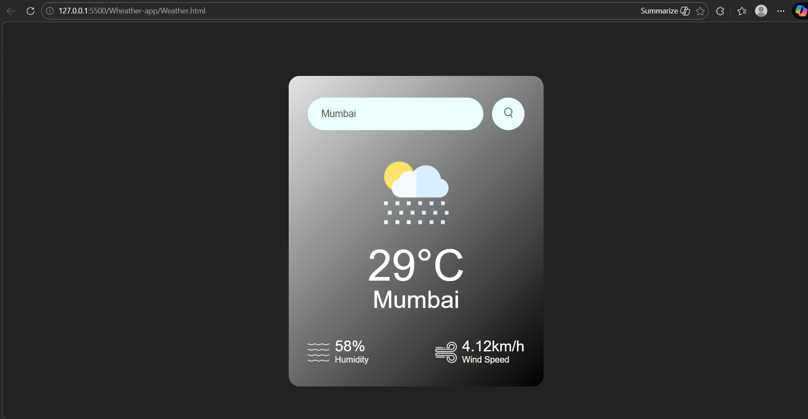
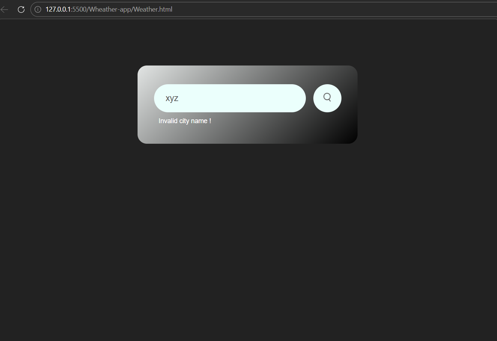

# 🌦️ Responsive Weather App

A beautiful, minimal, and fully responsive Weather Application built using vanilla **HTML, CSS, and JavaScript**. This app connects directly with the OpenWeatherMap API to deliver real-time weather details for any city worldwide.

---

## 🚀 Features

* **Real-Time Data:** Fetches current temperature, weather conditions, humidity, and wind speed.
* **Dynamic Visuals:** Weather icons update automatically based on the city's current climate (e.g., Clouds, Rain, Clear, Mist, Drizzle).
* **Robust Error Handling:** Instantly detects typos or invalid city names and alerts the user gracefully without crashing.
* **Fully Responsive:** Designed using modern CSS layout techniques, ensuring a seamless experience across mobile, tablet, and desktop screens.
* **Secure Environment Variables:** Leverages Vite's environment configuration to handle API keys cleanly during local development.

---

## 🛠️ Technologies Used

* **HTML5:** Semantic markup structure.
* **CSS3:** Custom styling, gradients, and responsive layouts.
* **JavaScript (ES6):** Fetch API, Async/Await asynchronous programming, and DOM manipulation.
* **Build Tool:** Vite (for local development server optimization).
* **API:** [OpenWeatherMap API](https://openweathermap.org/)

---

## 📸 Screenshots

### 🔍 Main Dashboard
*A clean interface focused on usability.*



### ⚠️ Error Handling
*Graceful UI transformation when an invalid city is provided.*



---

## ⚙️ How to Setup Locally

Follow these steps to get your development environment running locally:

### 1. Clone the repository
```bash
git clone [https://github.com/master-shubham/WeatherApp.git](https://github.com/master-shubham/WeatherApp.git)
cd WeatherApp